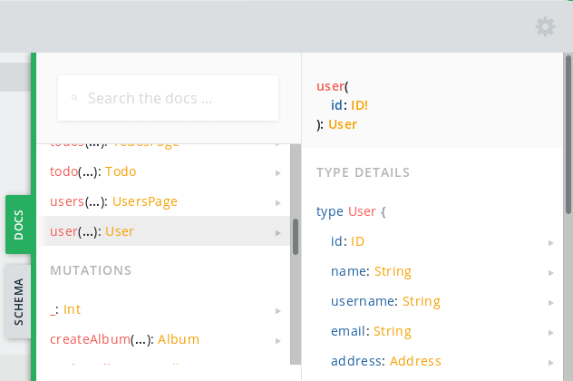

# [GraphQLZero](https://graphqlzero.almansi.me)

## A Simple, Zero-Config Fake GraphQL API

[GraphQLZero](https://graphqlzero.almansi.me) is a free, online GraphQL API that you can use to get fake data from a real backend while testing or prototyping your app. It is inspired and powered by [JSONPlaceholder](https://jsonplaceholder.typicode.com/), serving the same dataset but in the form of a GraphQL server. You'll find it useful for learning more about GraphQL, writing tutorials, testing new libraries, and more.

## Get Started

First, check out the [example queries and mutations](https://graphqlzero.almansi.me/#examples) that you can run right from our website. The easiest way to get started is by visiting the [GraphQL API Playground](https://graphqlzero.almansi.me/api), where you can see the API's docs and run queries against the real backend.

  
  
1) GraphQL Playground: Query Execution.

  
  
2) GraphQL Playground: API Docs.

## Schema

[GraphQLZero](https://graphqlzero.almansi.me) is powered by [JSONPlaceholder](https://jsonplaceholder.typicode.com/) and serves the same dataset in the form of a GraphQL API. Six different types of entities exist: users, posts, comments, todos, albums, and photos. These entities are also related to each other; for example, a user has many posts, a photo belongs to an album, etc.

For more information on how to query different entities, check out the [examples](https://graphqlzero.almansi.me/#examples) or dive into the full schema in the [GraphQL API Playground](https://graphqlzero.almansi.me/api).
